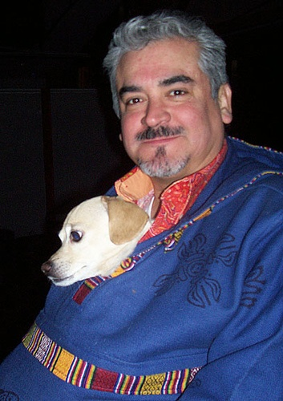

# YOLOv3 from Scratch

This repository contains a complete implementation of [YOLOv3 (You Only Look Once version 3)](https://pjreddie.com/darknet/yolo/) from scratch using PyTorch. The project includes the architecture setup, loading weights, and inference with sample test images.

## Project Structure

├── yolov3.ipynb # Jupyter notebook with the architecture setup, loading weights, and inference with sample test images. 
├── data/ # contains classes for COCO dataset 
├── images/ # test images 
├── dst/ # object detection applied test images(output of YOLO v3) 
├── cfg/ #Contains configuration file for YOLO v3 
├── yolov3.weights #pre-trained weights of YOLO v3 
├── pallete #for coloring the bounding box borders 
└── README.md # Project documentation 

## Features

- Full YOLOv3 model implementation from scratch
- Darknet-53 backbone
- Multi-scale detection (3 different scales)
- Supports Pascal VOC and COCO format
- Custom dataloader and transformation pipeline
- Trained model tested on sample images

## Model Architecture

## Model Overview

YOLOv3 improves upon previous YOLO versions by predicting bounding boxes at three different scales using **feature pyramid networks**. Each detection layer predicts 3 bounding boxes per grid cell, using predefined anchor boxes. The backbone used is **Darknet-53**, a convolutional neural network with residual connections and 53 convolutional layers.

### Detailed Architecture

#### **Darknet-53 Backbone**

| Layer Type        | Output Size | Filters | Kernel | Stride |
| ----------------- | ----------- | ------- | ------ | ------ |
| Conv + BN + Leaky | 416×416×32  | 32      | 3×3    | 1      |
| Conv + BN + Leaky | 208×208×64  | 64      | 3×3    | 2      |
| Residual Block ×1 | 208×208×64  |         |        |        |
| Conv + BN + Leaky | 104×104×128 | 128     | 3×3    | 2      |
| Residual Block ×2 | 104×104×128 |         |        |        |
| Conv + BN + Leaky | 52×52×256   | 256     | 3×3    | 2      |
| Residual Block ×8 | 52×52×256   |         |        |        |
| Conv + BN + Leaky | 26×26×512   | 512     | 3×3    | 2      |
| Residual Block ×8 | 26×26×512   |         |        |        |
| Conv + BN + Leaky | 13×13×1024  | 1024    | 3×3    | 2      |
| Residual Block ×4 | 13×13×1024  |         |        |        |

#### **Detection Head**

| Scale          | Feature Map | Detection Output |
| -------------- | ----------- | ---------------- |
| Small objects  | 13×13       | 255 channels     |
| Medium objects | 26×26       | 255 channels     |
| Large objects  | 52×52       | 255 channels     |

Each output layer predicts:  
`3 × (5 + num_classes)` per grid cell  
→ 3 anchors × (x, y, w, h, obj_conf + class_probs)

## Results

| Input (LR)                                  | SRGAN Output                                  |
| ------------------------------------------- | --------------------------------------------- |
|  |  |
|         |         |
